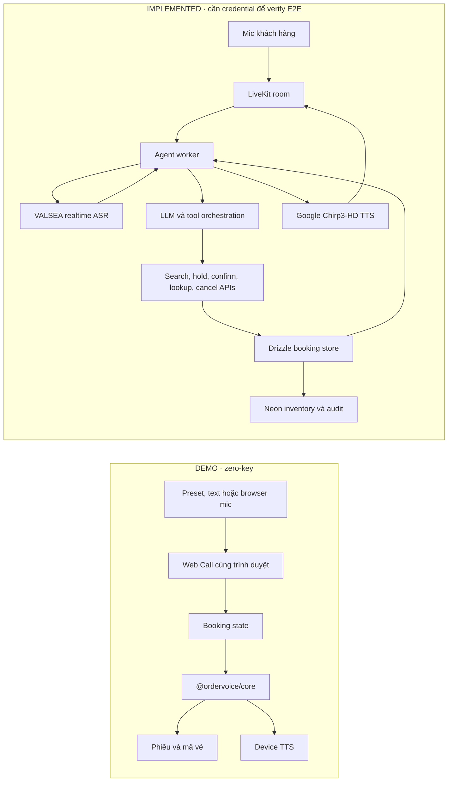

# Alove — Alo là có vé

> Biến một cuộc gọi tiếng Việt thành vé xe có hành trình, ghế, giá, mã vé và dấu vết xác nhận — không dừng ở transcript.

[Mở trải nghiệm khách hàng](https://vedi-one.vercel.app/) · [Mở workspace demo](https://vedi-one.vercel.app/console) · [Xem kịch bản 90 giây](docs/vedi-demo-script.md)

Alove là voice agent đặt vé cho nhà xe Việt Nam. Trong demo hiện tại, hành khách nói tự nhiên để tìm chuyến, cung cấp thông tin, nghe đọc lại và xác nhận; hệ thống chỉ phát hành vé khi đã đủ dữ liệu và nhận được câu chốt rõ ràng.

Vertical đầu tiên là nhà xe Mai Anh, tuyến Sài Gòn ⇄ Đà Lạt. Bài toán này chứng minh đúng tinh thần **speech-to-meaning**: giọng nói đi qua lớp hiểu ngôn ngữ rồi cập nhật một quy trình vận hành có trạng thái, thay vì chỉ tạo văn bản.

## Xem gì trong 3 phút

1. Mở [workspace demo](https://vedi-one.vercel.app/console), chọn **Agent tự động** và bấm **Bắt đầu Web Call**.
2. Gửi yêu cầu mẫu, chọn chuyến 22:00, gửi thông tin hành khách, xác nhận rồi bấm **Kết thúc**.
3. Quan sát phiếu cập nhật sau từng lượt và màn vé cuối có ghế, tổng tiền, điểm đón, QR cùng mã vé ổn định.
4. Tải lại trang, chuyển sang **Nhân viên** để xem cùng booking state được xử lý thủ công mà không có auto-reply.

Mic không bắt buộc. Preset và text fallback giữ luồng demo chạy được khi browser không hỗ trợ Speech Recognition hoặc khi không có API key.

## Vấn đề và lời giải

Nhiều quy trình tiếng Việt vẫn kết thúc ở nhập liệu thủ công hoặc một transcript phẳng. Với đặt vé qua hotline, thông tin phải được hiểu thành điểm đi, điểm đến, ngày, số khách, chuyến, ghế và hành động xác nhận.

Alove tách bài toán thành ba lớp:

- **Speech:** VALSEA nhận dạng tiếng Việt trong runtime pilot; browser speech chỉ là fallback cho demo.
- **Meaning:** agent thu thập slot, xử lý hội thoại và gọi tool theo trạng thái hiện tại.
- **Action:** demo dùng `@ordervoice/core`; pilot dùng booking APIs + Drizzle/Neon để xác định chuyến, giá, giữ ghế, chốt vé và huỷ vé.

LLM không phải nguồn sự thật cho dữ liệu vận hành. Nó có thể hiểu câu nói và điều phối tool trong pilot, nhưng chuyến, giá, ghế và booking code chỉ được lấy từ deterministic demo core hoặc database-backed booking APIs.

## Mức độ bằng chứng

| Nhãn | Ý nghĩa | Trạng thái hiện tại |
|---|---|---|
| `VERIFIED` | Đã chạy bằng test hoặc kiểm tra runtime trong checkout hiện tại | Booking core, API/UI behavior và test suite; landing cùng workspace public trả về thành công |
| `IMPLEMENTED` | Code và contract đã có, còn thiếu credential hoặc môi trường để xác minh end-to-end | VALSEA realtime adapter, `/engine`, LiveKit worker, booking APIs, Neon/Drizzle boundary |
| `DEMO` | Fallback xác định dành cho trình diễn ổn định, không được xem là production integration | Same-browser Web Call, browser voice tùy chọn, catalog Mai Anh tĩnh |
| `TARGET` | Kiến trúc hoặc năng lực của pilot tiếp theo | Cuộc gọi PSTN thật, inventory nhiều nhà xe, benchmark audio điện thoại, vận hành có SLO |

Lần kiểm tra README này, `pnpm test` pass **16 test files / 68 tests**. Live audio VALSEA → LiveKit → Google TTS chưa được xác minh end-to-end trong checkout này vì không có bộ credentials tương ứng.

## Hai runtime, hai booking path



Demo và pilot cố ý dùng hai booking path khác nhau: catalog tĩnh xác định cho zero-key demo; inventory có database seat hold với row locking cho pilot. Cả hai giữ cùng safety boundary: transport, speech provider và LLM không có quyền tự quyết dữ liệu vé.

## Luồng đặt vé

```text
Nhu cầu hành trình
  → đề xuất chuyến
  → chọn chuyến
  → giữ ghế
  → họ tên + số điện thoại
  → đọc lại toàn bộ
  → xác nhận rõ ràng
  → phát hành mã vé
```

Các invariant chính:

- Chỉ xử lý utterance cuối (`final`), không chốt từ partial transcript.
- Không xác nhận khi thiếu hành trình, ngày, số khách, chuyến, tên hoặc số điện thoại.
- Số ghế phải đủ cho số hành khách.
- Zero-key core và database-backed confirmation đều idempotent theo booking/call context.
- Pilot giữ ghế bằng một câu lệnh có row locking; caller cạnh tranh không thể cùng giữ một ghế.
- Human/Agent có thể đổi vai mà không làm mất transcript hoặc booking draft.

## Kiến trúc repository

| Khu vực | Trách nhiệm |
|---|---|
| [`apps/web`](apps/web) | Next.js 16 App Router: landing, Web Call, engine lab, dashboard, booking APIs và Drizzle store |
| [`packages/contracts`](packages/contracts) | Zod contracts cho call, trip, booking và provider boundary |
| [`packages/core`](packages/core) | Booking state machine và quy tắc xác nhận xác định |
| [`packages/providers`](packages/providers) | Adapter VALSEA, OpenAI, Twilio và ERP seams |
| [`apps/api`](apps/api) | Fastify media gateway cho browser/Twilio → VALSEA realtime |
| [`agent`](agent/README.md) | Python LiveKit worker: STT → tool → TTS |
| [`db`](db) | Neon/Drizzle schema, migration và persistence boundary |

Tên package `@ordervoice/*` là định danh workspace kế thừa; tên sản phẩm hiện tại là **Alove**.

## Chạy local

Yêu cầu: Node.js `>=20.9`, pnpm `10.33.0`.

```bash
pnpm install
pnpm dev:web
```

Mở:

- `http://localhost:3000/` — trải nghiệm hành khách của nhà xe Mai Anh.
- `http://localhost:3000/console` — workspace khách hàng + chăm sóc khách hàng.
- `http://localhost:3000/engine` — lab audio cho VALSEA và baseline đối chứng.
- `http://localhost:3000/dashboard` — call audit khi đã cấu hình persistence và access key.

Demo `/` và `/console` không cần database, LiveKit hoặc provider key.

## Bật VALSEA engine lab

`/engine` cần media gateway chạy cùng web app, trong hai terminal riêng:

```bash
pnpm dev:api
pnpm dev:web
```

Cấu hình server-side `VALSEA_API_KEY` cho process `apps/api`; đặt `NEXT_PUBLIC_GATEWAY_URL=http://localhost:3001` trong `apps/web/.env.local`. Thêm `OPENAI_API_KEY` phía server chỉ khi cần baseline Whisper đối chứng.

`NEXT_PUBLIC_GATEWAY_URL` là URL công khai, không phải secret. Không đặt API key, service-account JSON hoặc shared secret trong biến `NEXT_PUBLIC_*`, source code hay file được commit.

Browser Speech Recognition trong `/console` không phải bằng chứng VALSEA. Chỉ phiên audio thực sự đi qua gateway/worker VALSEA mới được tính là VALSEA runtime evidence.

## Bật LiveKit pilot

Pilot cần hai process độc lập:

1. Next.js web/API trên Vercel hoặc Node host.
2. [`agent`](agent/README.md) trên host giữ được long-lived outbound WebSocket.

Nhóm biến chính:

| Nhóm | Biến |
|---|---|
| LiveKit web | `LIVEKIT_URL`, `NEXT_PUBLIC_LIVEKIT_URL`, `LIVEKIT_API_KEY`, `LIVEKIT_API_SECRET`, `LIVEKIT_AGENT_NAME` |
| Agent ↔ web booking APIs | `NEXTJS_API_URL`, `AGENT_WEBHOOK_SECRET` |
| Speech/AI | `VALSEA_API_KEY`, `OPENAI_API_KEY`, `GOOGLE_TTS_CREDENTIALS_FILE` hoặc `GOOGLE_TTS_CREDENTIALS_JSON` |
| Persistence | `DATABASE_URL` |
| Dashboard | `DASHBOARD_ACCESS_KEY` |

`AGENT_WEBHOOK_SECRET` phải giống nhau ở web và worker. API keys, LiveKit secret, database URL và Google credentials luôn ở server/secret manager. Xem [LiveKit pilot](docs/livekit-bus-pilot.md), [worker guide](agent/README.md) và [PSTN/SIP runbook](docs/pstn-sip-runbook.md).

VALSEA cung cấp **STT/ASR** trong kiến trúc này. TTS ưu tiên **Google Cloud TTS Chirp3-HD**; Cartesia là fallback. Không có “VALSEA TTS” trong repository.

## Quality gates

```bash
pnpm lint
pnpm -r --if-present typecheck
pnpm test
pnpm test:e2e
pnpm build
```

Test bao phủ booking rules, idempotency, VALSEA protocol adapter, media gateway, API auth, UI behavior, speech fallback và Chromium flows. Kết quả production cũ hơn được lưu trong [release manifest](docs/vedi-release-manifest.md); không nên dùng manifest lịch sử thay cho một lần chạy mới.

## Giới hạn hiện tại

- Catalog zero-key chỉ có tuyến mẫu Sài Gòn ⇄ Đà Lạt; đây không phải inventory production.
- Browser demo là call simulation trong cùng thiết bị, không phải cuộc gọi hai thiết bị hay PSTN.
- VALSEA/LiveKit worker đã có code path nhưng chưa có fresh end-to-end audio proof trong checkout này.
- Chất lượng trên audio điện thoại 8 kHz, giọng vùng miền, code-switching và môi trường nhiễu vẫn cần benchmark cùng một bộ audio.
- Payment, gửi vé qua kênh thật, rate limiting hoàn chỉnh, retention/consent policy và multi-operator onboarding còn thuộc pilot hardening.

## Tài liệu chính

- [Quyết định zero-key Web Call](adrs/0007-bus-ticket-web-call-demo.md)
- [Quyết định VALSEA STT + Google Chirp3-HD TTS](adrs/0009-valsea-stt-google-chirp3-tts.md)
- [Kịch bản demo](docs/vedi-demo-script.md)
- [LiveKit pilot và trạng thái xác minh](docs/livekit-bus-pilot.md)
- [Khả năng tích hợp third party](docs/integration-feasibility.md)
- [Định dạng dữ liệu nhà xe](docs/operator-data-format.md)
- [Design system](docs/design-system.md)
- [Thiết kế sản phẩm](docs/superpowers/specs/2026-07-18-vedi-bus-ticket-voice-demo-design.md)

---

**Thông điệp cần nhớ:** VALSEA nghe tiếng Việt; agent hiểu ý định; booking layer phát hành vé. Alove chứng minh voice AI bằng một hành động có thể audit, không bằng một transcript đẹp.
