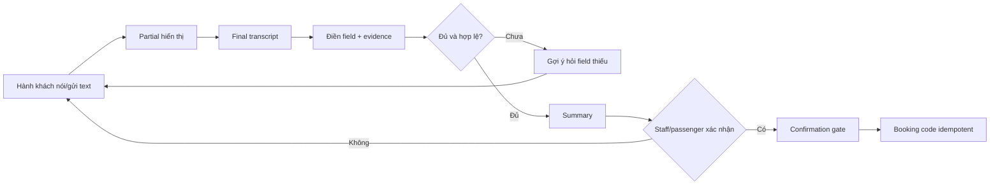

# VéĐi Product Brief

## Tóm tắt điều hành

VéĐi là AI Voice Agent tiếng Việt hỗ trợ nhân viên nhà xe tiếp nhận cuộc gọi đặt vé, chuyển hội thoại thành booking có cấu trúc và giữ con người tại điểm kiểm soát cuối. Sản phẩm ưu tiên khả năng giải thích, fallback và quyền takeover thay vì tự động hóa bằng mọi giá.

Demo hiện tại chứng minh luồng hai phía, transcript, tự điền có evidence, Human/Auto authority và confirmation gate bằng dữ liệu mẫu. LiveKit, VALSEA và Neon có implementation boundary nhưng chỉ được xem là **Code-ready** đến khi credentialed smoke test hoàn tất.

## Pitch 60 giây

> Mỗi cuộc gọi đặt vé buộc nhân viên vừa nghe, hỏi, nhập dữ liệu và kiểm tra. VéĐi biến final transcript tiếng Việt thành các trường booking có bằng chứng, chỉ hỏi phần còn thiếu và luôn để nhân viên giữ quyền. Nhân viên có thể giao Agent trả lời, takeover ngay và xác nhận booking sau khi đọc lại summary. Demo hôm nay chạy chắc chắn bằng hai tab cùng browser; kiến trúc đã tách sẵn LiveKit, VALSEA và Neon cho pilot có credential. Kết quả: quy trình nhất quán hơn, dễ audit hơn và có đường triển khai từng phase mà không claim quá khả năng hiện tại.

## Bài toán của nhà xe

- Dữ kiện xuất hiện không theo thứ tự, có sửa lại và chứa tiếng Việt/English code-switch.
- Nhập tay song song với hội thoại làm tăng thời gian xử lý và nguy cơ sai tuyến, ngày giờ hoặc số điện thoại.
- Voice automation không có evidence hoặc takeover tạo rủi ro nghiệp vụ và niềm tin.
- Catalog, ghế và chính sách thay đổi theo nhà xe; LLM không được tự bịa dữ liệu vận hành.
- Provider giọng nói, mạng hoặc database có thể lỗi giữa phiên; quy trình cần safe state rõ ràng.

## Người dùng và công việc cần hoàn thành

| Người dùng | Công việc | Kết quả mong muốn |
|---|---|---|
| Hành khách | Mô tả nhu cầu tự nhiên, bổ sung phần thiếu, xác nhận summary | Đặt vé nhanh, ít lặp lại, biết rõ nội dung xác nhận |
| Nhân viên CSKH | Nhận phiên, theo dõi, sửa/khóa field, giao/thu quyền Agent | Giảm thao tác nhập, vẫn kiểm soát quyết định |
| Dispatcher/supervisor | Theo dõi queue, owner, trạng thái và takeover | Vận hành nhiều phiên có audit và escalation |
| Admin nhà xe | Quản lý catalog, lịch, xe, ghế và quyền | Dữ liệu publish có version, không phụ thuộc LLM |
| Security/data owner | Duyệt consent, retention, access và incident | Dữ liệu thật chỉ chạy trong boundary đã phê duyệt |

## Hành trình từ cuộc gọi đến booking

Human là authority mặc định. Agent chỉ trả lời sau delegation; delegation không cấp quyền xác nhận.

## Giá trị mang lại

| Giá trị | Cơ chế | Cách đo trong pilot |
|---|---|---|
| Giảm nhập liệu lặp lại | Final-only field filling | Thời gian handle, số field phải nhập tay |
| Giảm sai dữ kiện | Exact quote, confidence, review/lock | Critical Field Accuracy |
| Tăng tính nhất quán | Missing-field navigation và validation | Booking Completion Rate |
| Giữ quyền con người | Human default, scoped Auto, takeover | Takeover Rate, audit review |
| Degrade an toàn | Text/preset và Human fallback | Tỷ lệ fallback, thời gian phục hồi |
| Dễ thẩm định | Source/test/deploy evidence map | Số capability đạt promotion gate |

Các giá trị trên là giả thuyết cần đo; không phải kết quả tài chính đã đạt.

## Điểm khác biệt

1. **Staff-first authority:** con người nhận và sở hữu phiên trước Agent.
2. **VALSEA-first credentialed voice path:** production worker yêu cầu VALSEA RTT/TTS; browser speech chỉ là labeled fallback.
3. **Final-only, evidence-backed filling:** partial không được lưu hoặc thay đổi booking; mỗi field truy ngược được về câu nói nguồn.
4. **Deterministic catalog và confirmation gate:** LLM không bịa chuyến/giá/ghế, không xác nhận booking.
5. **Human takeover và safe fallback:** failure giữ state gần nhất và hạ cấp, không tạo success giả.
6. **Provider-neutral boundaries:** contract/core tách khỏi transport, STT/TTS, LLM và persistence provider.

## Delivery profiles

| Profile | Dùng cho | Đã chứng minh | Không được suy rộng |
|---|---|---|---|
| Local/public fallback | Demo giám khảo, workshop | Hai tab cùng browser, text/preset, optional browser speech, booking demo | Không phải LiveKit/VALSEA/Neon live |
| Credentialed pilot | Technical pilot có kiểm soát | Chỉ sau smoke test account/region/latency/failure | Không tự động đạt chuẩn production |
| Target operations | Nhà xe vận hành nhiều phiên | Roadmap queue, role, catalog, inventory, observability | Không phải current demo |

## KPI cho pilot

| KPI | Định nghĩa |
|---|---|
| Critical Field Accuracy | Số critical fields đúng / tổng critical fields được review |
| Booking Completion Rate | Số session đạt xác nhận hợp lệ / số session đủ điều kiện |
| Average Handle Time | Thời gian từ lúc staff nhận đến khi kết thúc hoặc xác nhận |
| Agent Assist Rate | Số turn Agent xử lý hoặc gợi ý / tổng eligible turns |
| Takeover Rate | Số session cần Human takeover / số session đã giao Agent |
| First Final Latency | Thời gian từ audio start đến final transcript VALSEA đầu tiên |
| Cost per Completed Booking | Tổng chi phí vận hành tháng / số booking hợp lệ hoàn thành |

Baseline, target, sample size và ngưỡng go/no-go phải do khách hàng duyệt trước pilot. Demo hiện tại không cung cấp achieved KPI.

## Phạm vi và giới hạn

**Verified trong profile local/public:** UI hai phía, final-only filling, evidence, suggestion, Human/Auto boundary, safe fallback và confirmation demo.

**Code-ready, cần credentialed evidence:** LiveKit multi-device, Agent worker, VALSEA RTT/TTS và Neon persistence.

**Roadmap trước dữ liệu hành khách thật:** staff authentication, signed caller invite, consent/retention automation, transactional confirmation, monitoring/correlation và operator data workflows.

**Out of scope đến khi phê duyệt riêng:** payment, inventory đồng bộ hệ thống ngoài, seat guarantee bên ngoài, PSTN/SIP, Zalo raw-call audio, SMS delivery và autonomous confirmation.

## Bước tiếp theo

1. Chạy [Demo Playbook 5 phút](demo-playbook.md) bằng dữ liệu tổng hợp.
2. Review [Capabilities and Evidence](capabilities-and-evidence.md) để chốt baseline kỹ thuật.
3. Dùng [Adoption Guide](adoption-guide.md) xác định owner, consent, KPI và pilot scope.
4. Chốt ngân sách/phase tại [Business Case and Roadmap](business-case-and-roadmap.md).
5. Review [Kiến trúc](architecture.md) và [Trust and Operations](trust-and-operations.md) trước credentialed pilot.
