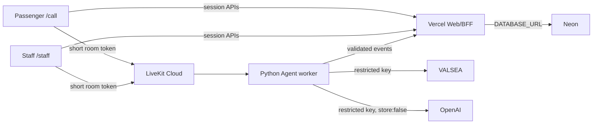

# Trust and Operations

## Tóm tắt

VéĐi áp dụng staff-first authority, final-only evidence và safe fallback. Public demo phù hợp dữ liệu mẫu; chưa phù hợp dữ liệu hành khách thật vì thiếu staff authentication, signed caller invite, durable confirmation transaction, retention automation và credentialed operational evidence.

Nguyên tắc:

1. Browser không nhận provider/database secret.
2. Partial transcript không trở thành booking evidence và không được persist.
3. Raw audio recording tắt mặc định.
4. Agent không có confirmation authority.
5. Provider/database failure giữ booking unconfirmed và chuyển Human/text fallback.
6. Current control, target requirement và evidence luôn được ghi tách biệt.

## Current trust boundary

**Current public profile:** browser local channel, no provider audio hoặc server-side passenger persistence; session code là routing/demo key, không phải authentication.

**Credentialed pilot target:** Vercel BFF cấp token ngắn hạn sau identity/session authorization; LiveKit truyền media; worker giữ VALSEA/OpenAI keys; Neon lưu final state/audit. Mỗi runtime có secret store và deployment/rollback độc lập.

### Current-versus-required control matrix

| Control | Current | Required before real passenger pilot | Evidence/gate |
|---|---|---|---|
| staff authentication | **Missing** — session code mở workspace | Required: identity, role, session assignment, MFA/SSO policy theo customer | Positive/negative auth tests + access review |
| signed caller invite | **Missing** — predictable session code | Required: signed, expiring, session-bound invite + rate limit | Expired/wrong-session/replay tests |
| Room-scoped short token | Implemented/code-tested, TTL 20 phút | Credentialed negative test và revocation/expiry behavior | `apps/web/src/lib/livekit/server.test.ts` + pilot smoke |
| Provider secret isolation | Implemented trong source/design | Deployment environment review và secret scan | Vercel/worker env inventory; client bundle scan |
| Raw audio recording | Off by default (`record=False`) | Separate affirmative consent trước bất kỳ recording | Worker config + consent/recording negative smoke |
| partial persistence | Disabled trong repository | Retain behavior: partial vẫn không persist | Repository tests + database query |
| Final transcript retention | Schema exists; schedule/job missing | Approved schedule, deletion/anonymization job và backup expiry | Data-owner approval + job evidence |
| confirmation transaction | Target only; local stable code không chứng minh durability | Required: actor authorization, summary/request hash, scoped idempotency, atomic booking | Concurrent/retry/conflict transaction tests |
| Correlation/monitoring | Partial; runbook defines target | Required end-to-end ID, alerts, redaction và on-call dashboard | Trace sample + alert/fallback exercise |
| Incident/rollback procedure | Documented | Exercise evidence và named owners | Tabletop + technical rollback report |

## Data inventory

| Data | Classification | Current public demo | Pilot target | Default retention/handling |
|---|---|---|---|---|
| Raw microphone audio | Sensitive biometric-adjacent content | Browser/device only; no server recording | Transient provider/room processing after consent | No recording; no retention |
| Partial transcript | Transient sensitive | UI state only | UI/worker transient | Không persist; drop nhanh |
| Final transcript | PII/sensitive | Browser session state | Neon after consent/policy | Customer-approved period; restricted access |
| Name/phone | PII | Synthetic only | Minimum booking need | Redact logs/exports; delete/anonymize per policy |
| Field evidence quote | PII/sensitive | Browser state | Linked to final message/revision | Minimal quote, restricted, retention aligned booking evidence |
| Booking draft/summary | Operational + PII | Demo state/code | Mutable draft then immutable confirmed snapshot | Draft expiry; confirmed record per policy/legal need |
| Staff identity/authority | Security/audit | Chưa có real identity | Required | Append-only authorization/audit evidence |
| Session/room/correlation IDs | Security/operational | Demo reference | Cross-component trace | Không dùng làm secret; redact external exports khi cần |
| Provider credentials | Restricted secret | Không có trong browser | Managed secret stores | Không log; rotate on exposure |
| Audit events | Restricted operational | Partial/local | Append-only, redacted | Policy-defined support/audit period |

Public session, screenshot và support ticket chỉ dùng synthetic data. Phone redaction mẫu: `0901***789`.

## Vai trò và quyền

| Role | Allowed | Prohibited | Pilot control |
|---|---|---|---|
| Passenger | Join own session, provide/correct facts, accept summary | Access other session, staff controls, secrets | Signed invite + own-session authorization |
| Customer-care staff | Assigned session, reply, edit/lock, delegate/takeover, authorized confirm | Invent passenger evidence, bypass gate, access provider secret | Auth + role + owner lock + `booking:confirm` scope |
| Supervisor/dispatcher | Assign/reassign, observe, stop pilot, review audit | Alter immutable evidence/confirmation | Elevated role + reason/audit |
| Agent | Ask/suggest/reply under delegation | Confirm, write booking, claim payment/inventory success | Policy guard + no confirmation API capability |
| Web/BFF service | Validate role/session, issue token, invoke core, persist | Expose secret, host long-lived voice loop | Server-only env, schema/authorization tests |
| Agent worker | Consume caller audio, emit normalized events, TTS | Make booking policy decision, persist confirmed booking directly | Caller identity filter + typed events |
| Support/data owner | Restricted review/deletion under process | Broad transcript export hoặc ad-hoc retention | Approved tool, access log, separation of duties |

Reply authority và confirmation authority là hai quyền khác nhau. Auto delegation không cấp quyền xác nhận.

## Consent và audio

Trước credentialed audio:

- hiển thị notice tiếng Việt nêu purpose, provider/processor, recording choice và text alternative;
- ghi affirmative `audio_consent_at` trước khi join provider path;
- cho phép từ chối microphone và tiếp tục bằng text/preset;
- recording luôn opt-in riêng, không gộp vào audio processing consent;
- không dùng recording cho training/evaluation nếu chưa có purpose/retention approval riêng;
- dùng synthetic hoặc consented sample cho benchmark accent/noise/code-switch.

Worker hiện đặt `record=False`. LiveKit Agent observability recording cũng phải tắt trừ khi policy và consent đã được duyệt.

## Secrets và tokens

| Runtime | Secret được giữ | Không được nhận |
|---|---|---|
| Browser | Chỉ short-lived participant token của chính session/role | LiveKit API secret, VALSEA/OpenAI key, `DATABASE_URL`, signing secret |
| Vercel BFF | LiveKit server credentials, BFF signing/session secret, database access theo cần thiết | Worker-only key nếu không dùng tại BFF |
| Agent worker | LiveKit credentials, `VALSEA_API_KEY`, approved LLM/TTS key | Browser token/storage hoặc customer admin credential |
| Migration job | Least-privilege `DATABASE_URL` | Provider media keys |

Rules:

- không đặt secret trong `NEXT_PUBLIC_*`, URL, source, fixture, log, screenshot hoặc support ticket;
- token bound vào room, identity, role/grants và TTL; refresh qua BFF;
- suspected exposure: disable issuance/provider route, revoke, rotate, redeploy, review logs/access;
- webhook/gateway tương lai phải verify raw-body signature, timestamp/replay và provider event ID trước parse/action.

## Retention và deletion

Trước pilot, data owner phê duyệt:

1. Mục đích và retention period cho final transcript, evidence, booking và audit.
2. Draft/session expiry; superseded evidence policy.
3. Backup/restore window và thời điểm dữ liệu hết trong backup.
4. Deletion/anonymization owner, SLA và exception pháp lý.
5. Access roles và review cadence.

Deletion request dùng session/booking reference đã xác minh, xóa/anonymize eligible data, giữ tối thiểu record bắt buộc, tạo redacted retention audit event và trả completion reference. Không sửa backup tùy tiện; dữ liệu hết theo expiry đã công bố.

Schema hiện có final message/snapshot/audit seam nhưng chưa có automated retention/deletion job. Vì vậy persistence code không đủ để claim retention compliance.

## Deployment topology

| Plane | Runtime | Responsibility | Failure isolation |
|---|---|---|---|
| UI/BFF | Vercel | `/staff`, `/call`, config/health, short token/session APIs | Roll back web deployment; disable flags |
| Realtime | LiveKit Cloud | Room, WebRTC, TURN, named dispatch | Disconnect/reconnect; Human/text fallback |
| Voice | LiveKit Agent worker/container | VALSEA RTT, guarded LLM, VALSEA TTS | Stop/redeploy worker; web stays available |
| Data | Neon + migration job | Final state, evidence, audit, target confirmation | Close confirmation; recover/migrate independently |
| Optional gateway | Fastify separate service | Future webhook/PSTN/direct media | Disable route; never couple to Next.js request lifecycle |

Voice worker không chạy trong Vercel Function vì cần long-lived realtime connection. Environment, health, release ID và rollback của web/worker/data phải được ghi riêng.

## Monitoring và audit

Minimum pilot telemetry:

- correlation ID ổn định qua browser, BFF, worker, provider metadata và database;
- event ID riêng cho retry/dedupe;
- runtime profile, session reference, actor role, component, error class, outcome và timestamp;
- readiness: web, token, room, worker, VALSEA, LLM/TTS, database;
- latency: join, first partial, first final, suggestion, TTS first byte;
- safety: unauthorized attempt, takeover, confirmation accepted/rejected, idempotency conflict;
- privacy: consent, retention/deletion action, secret rotation, access review.

Logs không chứa raw audio, full transcript, full phone, token, authorization header hoặc database URL. Audit event không thay thế authoritative confirmation record.

## Degraded modes

| Failure | Safe state | Fallback | Không được claim |
|---|---|---|---|
| Microphone/browser speech | Draft giữ nguyên | Text/preset; Human | Live STT |
| LiveKit disconnect | Gate đóng đến khi state revalidate | Controlled reconnect hoặc local/manual channel | Realtime call success |
| VALSEA timeout/malformed | Giữ final validated state; bỏ partial | Human/text; retry có trạng thái rõ | Provider transcript success |
| LLM/TTS error | Không spontaneous/synthetic success | Text suggestion hoặc Human speech | Agent voice success |
| Database unavailable | Booking unconfirmed; không mint durable code | Tiếp tục non-confirming conversation, recover DB | Persisted/confirmed booking |
| Catalog/inventory unavailable | Dừng ở draft | Staff/manual operator check | Real fare/seat guarantee |

Fallback không được nâng authority hoặc thay đổi evidence provenance.

## Incident và escalation

| Incident | Safe state | Fallback/recovery action | Recovery signal | Owner |
|---|---|---|---|---|
| Microphone denied/unsupported | Giữ draft; không audio claim | Text/preset, staff takeover | Final text gửi được hoặc permission được cấp | Demo/staff operator |
| LiveKit disconnect | Đóng confirmation đến revalidation | Controlled reconnect cùng authorized session | Participants/worker ready, state hash khớp | Realtime/worker owner |
| VALSEA failure | Không dùng partial, giữ final cũ | Human/text; provider retry theo runbook | New final hợp lệ + error rate hồi phục | VALSEA/provider owner |
| LLM/TTS failure | Human authority, không phát success giả | Text suggestion/manual reply | Valid response/TTS và guard smoke pass | Agent owner |
| Database failure | `unconfirmed`, không code mới | Recover DB, retry cùng scoped key | Health/migration pass; canonical transaction result | Data/on-call owner |
| Duplicate confirmation | Dừng issuance; exact retry chỉ trả same code | Reconcile authoritative record; reject conflict | Một booking/confirmation canonical + audit | Booking-core owner |
| Leaked credential | Disable affected integration/issuance | Revoke, rotate, redeploy, access/log review | Old credential invalid; new smoke pass | Security + runtime owner |
| PII exposure | Stop export/pilot scope; preserve redacted evidence | Contain, assess, notify, delete/rotate theo plan | Incident lead closes actions; access corrected | Security/data owner |

SEV-1: unauthorized/duplicate booking, PII hoặc secret exposure. SEV-2: multi-session provider/data outage. SEV-3: isolated session defect. Customer notification time và contacts phải chốt trước pilot.

## Rollback

Rollback trigger:

- authorization/token/session isolation regression;
- consent/redaction/retention failure;
- duplicate/incorrect confirmation;
- provider failure tạo unsafe state;
- migration/data integrity threat;
- error/latency vượt pilot threshold.

Order:

1. Stop/cap affected traffic và disable integration flags/ingress.
2. Chuyển Human/text; giữ confirmation gate đóng cho session bị ảnh hưởng.
3. Preserve redacted correlation evidence; notify owner/customer theo severity.
4. Revert web/worker/gateway độc lập; data thường roll forward bằng corrective migration, chỉ rollback nếu plan đã review.
5. Reconcile pending sessions/bookings; chạy synthetic smoke.
6. Mở lại traffic khi recovery signal và approver pass.

Rollback không biến output mô phỏng thành real booking, hold, payment hoặc delivery.

## Shared responsibility

| Area | Customer/operator | VéĐi product/team | Provider | Evidence owner |
|---|---|---|---|---|
| Identity và staff access | Roster, role approval, offboarding | Auth/authorization implementation, audit | IdP service availability nếu dùng | Security owner |
| Sample/real passenger consent | Legal basis, notice approval, participant process | Consent UX/event và fallback | Processor terms | Data owner |
| Provider accounts | Contract, billing owner hoặc delegated approval | Secure configuration, integration/fallback | Service/SLA/support | Provider owner |
| Catalog accuracy | Source, version, fare/trip approval | Validation/publish workflow | External operator nếu tích hợp | Bus-operator admin |
| Retention approval | Period, exception, deletion SLA | Job/tool/redaction implementation | Storage/backup mechanics | Data owner |
| Application security | Customer access/network requirements | Secure SDLC, token/API controls, fixes | Platform controls | Engineering/security |
| Worker availability | Pilot schedule/escalation expectation | Deploy, scale, monitor, rollback | LiveKit/host availability | Realtime owner |
| Monitoring | Threshold/notification recipients | Metrics, correlation, alerts, runbook | Provider status/usage telemetry | On-call owner |
| Incident notification | Contacts, business response | Detection, technical response, evidence | Vendor escalation | Incident lead |
| Deletion requests | Verify requester và legal decision | Execute/anonymize/audit | Backup expiry/support | Data owner |

Shared responsibility không chuyển confirmation authority cho Agent hoặc provider.

## Pilot blockers

Các blocker bắt buộc trước real passenger pilot:

- staff authentication, role, session assignment và confirmation authorization;
- signed caller invite, expiry/replay defense và API rate limit;
- approved consent, recording-off verification, retention/deletion schedule;
- credentialed LiveKit/VALSEA/Neon positive + negative smoke;
- durable confirmation transaction, scoped idempotency và conflict tests;
- correlation, redacted logs, alerts, on-call và incident exercise;
- staff training, Human fallback và customer-approved KPI/traffic cap;
- release manifest + rollback evidence.

Queue/dashboard/catalog/seat hold chỉ bắt buộc nếu pilot scope claim các capability đó. Payment, external seat guarantee, PSTN/SIP và delivery vẫn out of scope đến gate riêng.

## Detailed appendices

- [Security and Privacy Policy](security-and-privacy.md) — control policy, threats và audit requirements.
- [Deployment Guide](deployment.md) — profiles, secrets, migrations và release gates.
- [Operations Runbook](operations-runbook.md) — preflight, detection, incident steps và evidence.
- [Data Model](data-model.md) — current schema mapping và target confirmation/idempotency model.
- [Architecture](architecture.md) — architecture and trust boundaries.
- [LiveKit + VALSEA Deployment](livekit-valsea-deployment.md) — worker setup và credentialed smoke.
- [Adoption Guide](adoption-guide.md) — roles, onboarding, training và go-live checklist.
